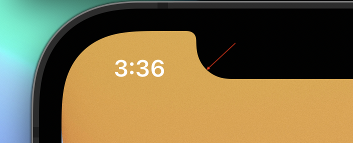

# NotchCorners

<!-- # Badges -->

[](https://github.com/p-x9/NotchCorners/issues)
[](https://github.com/p-x9/NotchCorners/network/members)
[](https://github.com/p-x9/NotchCorners/stargazers)
[](https://github.com/p-x9/NotchCorners/)

You can get the notch's corner radius and size.

## Usage
- Notch Size

```swift
UIScreen.main.notchSize
```

- Notch Top Corner Radius


```swift
UIScreen.main.notchTopCornerRadius
```


- Notch Bottom Corner Radius



```swift
UIScreen.main.notchBottomCornerRadius
```


- Display  Corner Radius


```swift
UIScreen.main.displayCornerRadius
```

## Sample
[GamingWindow](https://github.com/p-x9/GamingWindow)


